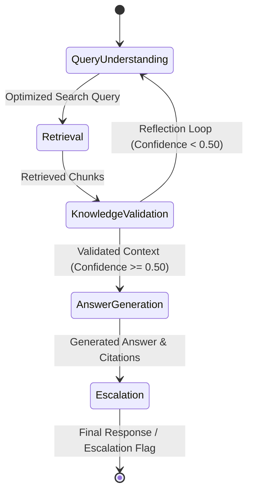
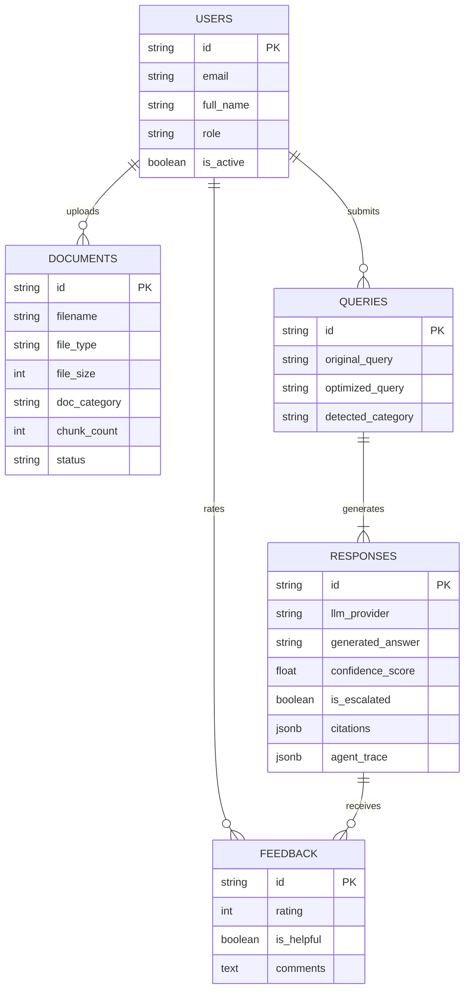

# SupportIQ – Technical Architecture & Deep Dive

## Architecture Overview

SupportIQ utilizes a modular, microservices-ready architecture that cleanly decouples Agentic RAG orchestration, multi-LLM reasoning, vector embeddings storage, relational database persistence, and modern reactive frontends.

---

## 1. LangGraph Multi-Agent Workflow Specification

The multi-agent system uses LangGraph state graph management:

### State Management (`AgentState`)
- `user_query`: Raw question submitted by support executive.
- `llm_provider`: Configured LLM engine (`gemini`, `openai`, `groq`).
- `detected_category`: Auto-detected documentation category.
- `optimized_query`: Keyword-rich query rewritten by Query Understanding Agent.
- `retrieved_chunks`: Top-K document chunks from ChromaDB/FAISS.
- `validated_context`: Cleaned context string with chunk markers `[1]`, `[2]`.
- `generated_answer`: Structured response formatted in markdown.
- `citations`: Array of source metadata (document name, category, page, snippet).
- `confidence_score`: Floating-point score (0.0 to 1.0) indicating factual coverage.
- `is_escalated`: Boolean flag indicating required human intervention.
- `agent_trace`: Audit trace recording execution latency and state changes for real-time timeline visualization.

---

## 2. Prompt Engineering Patterns

SupportIQ incorporates six core prompt engineering techniques across nodes:

1. **System Prompts**: Establish strict behavioral boundaries (e.g. "Answer ONLY using validated context").
2. **Role Prompts**: Assign domain personas (e.g. "Knowledge Validation Agent").
3. **Chain-of-Thought Style Reasoning**: Internal evaluation of document coverage prior to output synthesis.
4. **Structured Output Prompts**: Enforce JSON schema responses for deterministic node parsing.
5. **Retrieval-Augmented Prompts**: Embed retrieved document chunks with numerical reference tags.
6. **Guardrail Prompts**: Flag unverified content and instruct explicit escalation when confidence drops below safety thresholds.

---

## 3. Database Schema ER Diagram

---

## 4. Security & Compliance
- **Authentication**: JWT token authentication with configurable expiration.
- **RBAC**: Enforces role access (`Admin`, `Support Agent`, `Viewer`).
- **Rate Limiting**: Integrated `slowapi` rate limiting preventing API abuse.
