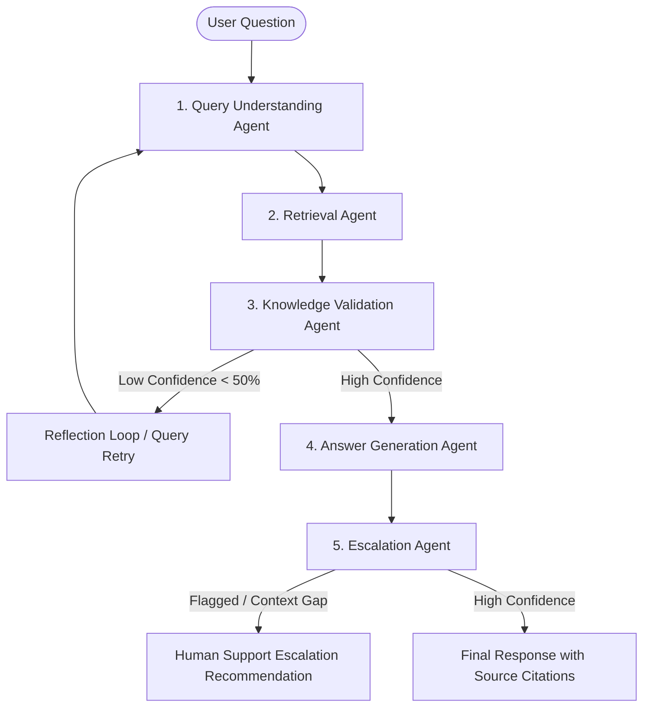

# SupportIQ – Smart Customer Support Knowledge Assistant

[](https://www.python.org/)
[](https://fastapi.tiangolo.com/)
[](https://reactjs.org/)
[](https://python.langchain.com/)
[](LICENSE)

**SupportIQ** is an enterprise-grade AI-powered customer support knowledge assistant designed for high-precision document retrieval and reliable answer synthesis. It eliminates manual searching across company documentation (FAQs, User Manuals, Product Documentation, Troubleshooting Guides, Warranty Policies, Refund Policies, and Internal Knowledge Bases) by deploying **Agentic RAG**, multi-agent orchestration via **LangGraph**, vector search with **ChromaDB**, multi-LLM support (**Google Gemini 2.5 Flash**, **OpenAI GPT**, **Groq API**), and a modern dark SaaS React dashboard.

---

## 🌟 Key Features & Agentic Architecture



### 1. LangGraph Multi-Agent Engine
- **Query Understanding Agent**: Extracts intent, detects category, and rewrites questions into vector-optimized search queries.
- **Retrieval Agent**: Queries ChromaDB/FAISS vector store using similarity search and MMR ranking.
- **Knowledge Validation Agent**: Filters noise, computes confidence score, and triggers a reflection retry loop when context coverage is insufficient.
- **Answer Generation Agent**: Generates concise, accurate answers with numbered inline citations `[1]`, `[2]`.
- **Escalation Agent**: Detects knowledge gaps or confidence drops (<65%) and recommends actionable human support escalation workflows.

### 2. Multi-LLM Provider Layer
Dynamically switch between:
- **Google Gemini 2.5 Flash** (Primary Default)
- **OpenAI GPT-4o-mini**
- **Groq Llama 3.3 70B**

### 3. Enterprise RAG Pipeline
- **Supported File Parsing**: PDF, DOCX, TXT, Markdown (MD), CSV.
- **Chunking Strategy**: `RecursiveCharacterTextSplitter` (Chunk Size: 1000, Overlap: 200).
- **Embeddings**: Gemini Embeddings (`models/embedding-001`) with HuggingFace (`all-MiniLM-L6-v2`) and local deterministic fallback.
- **Vector Database**: Persistent ChromaDB with FAISS fallback.

### 4. Modern Dark SaaS Dashboard
- **Dashboard**: High-level KPIs (Total Documents, Queries Processed, Average Confidence, Satisfaction Score).
- **Ask AI Page**: Interactive chat with real-time **Agent Timeline**, **Confidence Gauge**, **Citation Cards**, and **Escalation Banners**.
- **Document Management**: Drag-and-drop file uploader, category tagging, index status, document deletion, and re-indexing.
- **Analytics Page**: Recharts visualizations for query trends over time, document category breakdown, top support questions, and agent performance.

---

## 🚀 Quick Start & Installation

### Option 1: Docker Compose (Recommended)

```bash
# 1. Clone Repository
git clone https://github.com/your-username/SupportIQ.git
cd SupportIQ

# 2. Configure Environment Variables
cp .env.example .env  # Add your GEMINI_API_KEY, OPENAI_API_KEY, or GROQ_API_KEY

# 3. Launch Services
docker-compose up --build
```

Access:
- **Frontend App**: `http://localhost:3000`
- **FastAPI Backend API**: `http://localhost:8000`
- **Interactive OpenAPI Docs**: `http://localhost:8000/docs`

---

### Option 2: Local Development Setup

#### Backend Setup (FastAPI + LangGraph)

```bash
cd backend
python -m venv venv
# On Windows:
venv\Scripts\activate
# On Linux/macOS:
source venv/bin/activate

pip install -r requirements.txt
python app/main.py
```

#### Frontend Setup (React + Vite + Tailwind CSS)

```bash
cd frontend
npm install
npm run dev
```

---

## 🧪 System Evaluation Benchmark

Run the automated evaluation suite generating 100 synthetic test queries:

```bash
cd backend
python evaluate_system.py
```

### Metrics Tracked:
- **Accuracy**
- **Precision**
- **Recall**
- **F1 Score**
- **Retrieval Accuracy**
- **Hallucination Rate**

---

## 📂 Project Structure

```
SupportIQ/
├── backend/
│   ├── app/
│   │   ├── agents/          # LangGraph Multi-Agent Architecture
│   │   ├── api/             # FastAPI v1 REST Endpoints & Auth
│   │   ├── core/            # Config, Security (JWT & RBAC), Rate Limiter
│   │   ├── db/              # SQLAlchemy Models & Sessions
│   │   ├── models/          # Pydantic Schemas
│   │   ├── rag/             # Ingestion, Embeddings, ChromaDB Store
│   │   └── services/        # Multi-LLM Provider Factory & Analytics
│   ├── evaluate_system.py   # Benchmark Evaluation Pipeline
│   ├── schema.sql           # PostgreSQL Schema (Users, Docs, Queries, Feedback)
│   └── Dockerfile
├── frontend/
│   ├── src/
│   │   ├── components/      # AgentTimeline, ConfidenceGauge, CitationCard, Charts
│   │   ├── pages/           # Dashboard, AskAI, Documents, Analytics
│   │   ├── services/        # API Client with Live Fallback
│   │   └── types/           # TypeScript Definitions
│   └── Dockerfile
├── docker-compose.yml
├── .github/workflows/ci-cd.yml
└── README.md
```

---

## 📄 License
Distributed under the MIT License.
